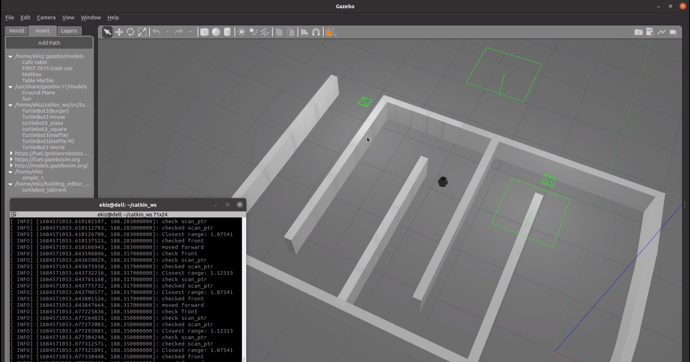
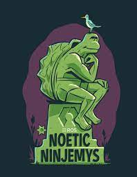

# My ROS Packages

Simple ROS Noetic and turtlesim applications in C++.

## Packages
- [my_laser_scan](https://github.com/AhmetEkiz/my_ros_pkgs/tree/main/my_laser_scan) : Move robot with laser scan data.
- [my_gazebo_worlds](https://github.com/AhmetEkiz/my_ros_pkgs/tree/main/my_gazebo_worlds) : Simple Gazebo Worlds that I created for testing my codes.
- [my_laser_outputs](https://github.com/AhmetEkiz/my_ros_pkgs/tree/main/my_laser_outputs) : It prints laser scan data as a index and range. Helps to analyze the output of scan data. 
- [my_ros_pkg_1](https://github.com/AhmetEkiz/my_ros_pkgs/tree/main/my_ros_pkg_1) : Get started with turtlesim.

