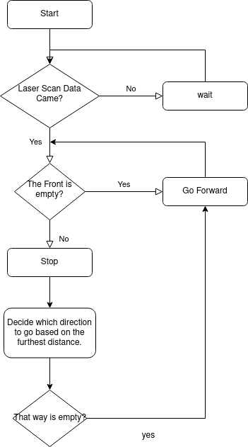

# my_laser_scan
Read laser scan data from Turtlebot3 and if the front is empty move forward, if it's not, turn right or left that which is the furthest. 


[Reviewing Laser Scan Data](https://github.com/AhmetEkiz/my_ros_pkgs/tree/main/my_laser_scan)

## Run
```bash
# write these commands below on the file. Last one will be the valid. 
# Re-read to run commands by source ~/.bashrc
export TURTLEBOT3_MODEL=burger
export TURTLEBOT3_MODEL=waffle_pi
export TURTLEBOT3_MODEL=waffle

# to run gazebo simulation with in the turtlebot3_world
roslaunch turtlebot3_gazebo turtlebot3_world.launch
# with empty world
roslaunch turtlebot3_gazebo turtlebot3_empty_world.launch

# to control bot with keyboard
roslaunch turtlebot3_teleop turtlebot3_teleop_key.launch

# run my node
rosrun my_laser_scan stopper
```

## Setup

```bash
cd ~/catkin_ws/src
catkin_create_pkg my_laser_scan std_msgs roscpp
```

```bash
# add this to CMakeList.txt which already added
add_executable(stopper src/Stopper.cpp src/run_stopper.cpp)

target_link_libraries(stopper ${catkin_LIBRARIES})
```

```bash
cs   # to go to catkin_ws/src folder

catkin_make   # compile

rosrun my_laser_scan stopper   # to run
```

## Flow Diagram

