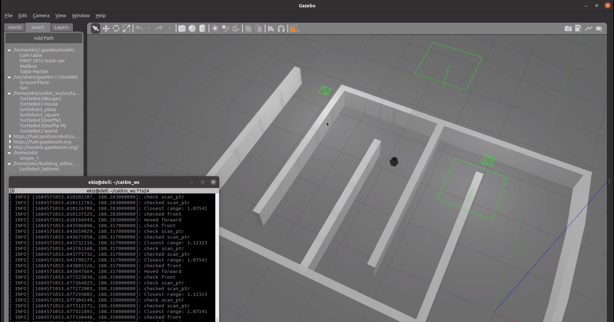
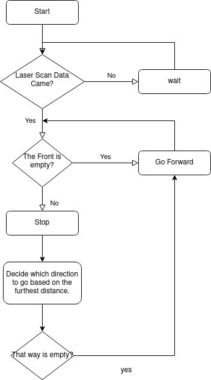

# my_laser_scan
Turtlebot3 ile Laser Scan verisini okuyup, aracın önü boş ise ileri, 0.3m yakında bir cisim var ise daha uzun mesafe boş olan sağ ya da sol tarafa dön ve ilerleyen node.



[Laser Scan Verilerini İncele](https://github.com/AhmetEkiz/my_ros_pkgs/tree/main/my_laser_scan)

## Run
```bash
# Turtlebot3 modeli seçmek için bash komut satırına yaz.
# source ~/.bashrc komutunu kullanarak yeni bir bash komut satırı açmadan değişiklikleri okut
export TURTLEBOT3_MODEL=burger
export TURTLEBOT3_MODEL=waffle_pi
export TURTLEBOT3_MODEL=waffle

# turtlebot3_world ile gazebosimülasyon ortamını çalıştır.
roslaunch turtlebot3_gazebo turtlebot3_world.launch
# boş bir dünya ile çalıştır.
roslaunch turtlebot3_gazebo turtlebot3_empty_world.launch

# klavye ile turtlebot3'ü kontrol et
roslaunch turtlebot3_teleop turtlebot3_teleop_key.launch

# paketi çalıştır
rosrun my_laser_scan stopper
```

## Setup

Baştan kurmak istersen:
```bash
cd ~/catkin_ws/src
catkin_create_pkg my_laser_scan std_msgs roscpp
```

```bash
# bu satırları CMakeList.txt'e ekle. Bu klasördeki CMakeList.txt'de ekli
add_executable(stopper src/Stopper.cpp src/run_stopper.cpp)

target_link_libraries(stopper ${catkin_LIBRARIES})
```

```bash
cs   # catkin_ws/src klasörüne gitmek için

catkin_make   # dosyaları derlemek için

rosrun my_laser_scan stopper   # çalıştır
```

## Flow Diagram

