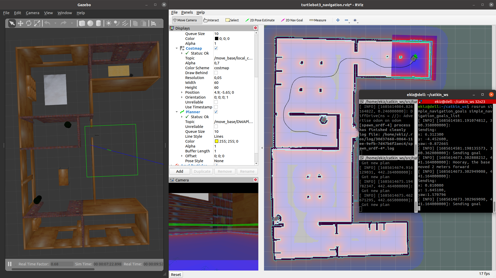

# Simple Navigation Goals
Turtlebot3'ü SLAM algoritmasıyla haritası çıkarılmış `house` haritasında verilen noktalara sırayla götürme uygulaması.



# Run - Çalıştır

```bash
roslaunch turtlebot3_gazebo turtlebot3_house.launch

roslaunch turtlebot3_navigation turtlebot3_navigation.launch map_file:=$HOME/house.yaml
# from same folder  (catkin_ws/src/my_ros_pkgs/simple_navigation_goals)
roslaunch turtlebot3_navigation turtlebot3_navigation.launch map_file:=/home/ekiz/catkin_ws/src/my_ros_pkgs/simple_navigation_goals/house.yaml

rosrun simple_navigation_goals simple_navigation_goals

rosrun simple_navigation_goals simple_navigation_goals_list
```

# Setup - Yeni Paket Oluştur

- Yeni paket oluştur
  - Pakedimizin bağımlılıkları `move_base_msgs`, `actionlib`, ve `roscpp` paketlerini ekliyoruz:

```bash
cs
cd my_ros_pkgs   # my folder

catkin_create_pkg simple_navigation_goals move_base_msgs actionlib roscpp tf
```


```makefile
# add these to CMakeLists.txt
add_executable(simple_navigation_goals src/simple_navigation_goals.cpp)
add_executable(simple_navigation_goals_list src/simple_navigation_goals_list.cpp)

target_link_libraries(simple_navigation_goals ${catkin_LIBRARIES})
target_link_libraries(simple_navigation_goals_list ${catkin_LIBRARIES}
```

- Compile:
```bash
cs
cd ..   # catkin_ws

# to compile
catkin_make
```


# Sources
- https://github.com/ros-planning/navigation_tutorials/blob/indigo-devel/simple_navigation_goals_tutorial/src/simple_navigation_goals.cpp

# Görseller - Adımlar


